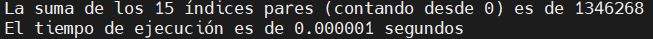
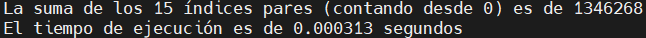
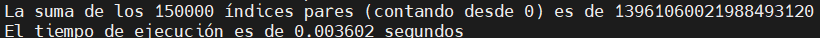
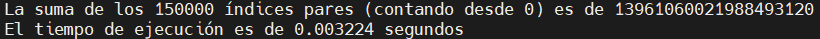

# Taller 1 - Problema Fibonacci

## Contenido

El archivo "sumafibopar.c" contiene el código implementado para sumar los indices pares de manera secuencial, mientras que el archivo "omp_sumafibopar.c" contiene el código implementado paralelamente para el desarrollo de esta tarea. También se tienen 4 archivos .png los cuales muestran los resultados de cada algoritmo con bastantes y pocos indices.

## Instrucciones

Para ejecutar el archivo de forma secuencial se utiliza el este comando donde previamente a sido descagado el archivo "sumafibopar.c": `gcc -Wall -fopenmp -std=c99 sumafibopar.c -o sumafibopar`, seguido de `./sumafibopar`.

Para ejecutar el archivo de forma paralela se compila el archivo "omp_sumafibopar.c" con el comando: `gcc -Wall -fopenmp -std=c99 omp_sumafibopar.c -o omp_sumafibopar`, seguido de `./omp_sumafibopar`.

## Resultados

Al ejecutar los archivos mencionados, se obtuvieron los siguientes resultados de suma y tiempo:

- Con n = 15:
  
  - Forma secuencial:
    
  

  - Forma Paralela:
    
  

- Con n = 150000:
  - Forma secuencial:
    
  
  
  - Forma Paralela:
    
  

## Conclusiones

Se puede observar un menor tiempo de ejecución de forma secuencial cuando se trabaja con n = 15. Sin embargo cuando realizamos las pruebas con n = 150000 se observa un menor tiempo de manera paralela. 

Lo que nos lleva a concluir que cuando se quieren sumar pocos valores la forma secuencial es más efectiva que la forma paralela, pero cuando ya se quieren trabajar con números más grandes sí es recomendable utilizar la forma paralela, entre mayor sea el número más diferencia de tiempo existirá. Esto debido a que de forma paralela los hilos acceden a diferentes posiciones del vector en donde se encuentran los resultados de los indices pares de la serie de Fibonacci y cada hilo va sumando diferentes posiciones hasta que al final todos su combinan y dan resultado a una única variable.
